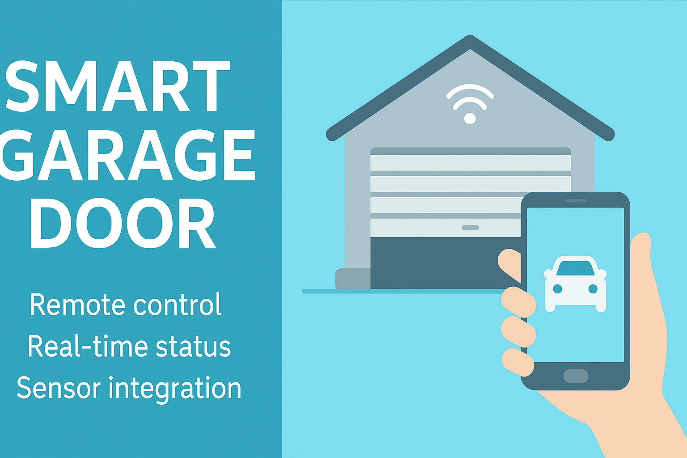

# Smart Garage Door – IoT System

[](https://www.python.org/)
[](LICENSE)
[]()
[]()

<p align="center">
  
</p>

---

## Overview

**Smart Garage Door** è un progetto **Internet of Things (IoT)** sviluppato nell’ambito del corso  
*Internet of Things and Digital Twins* del Corso di Laurea Magistrale in  
**Computer Engineering, Cybersecurity and Artificial Intelligence** – **Università di Cagliari**.

Il progetto mira alla realizzazione di un **sistema intelligente per il controllo remoto e automatizzato di una porta da garage**, basato su un’architettura IoT **a tre livelli** (*Perception – Network – Application*), progettata secondo i principi del **System Development Life Cycle (SDLC)**.

L’intero sistema è stato concepito per essere:
- modulare e scalabile,
- affidabile,
- basato su protocolli standard aperti,
- sostenibile dal punto di vista economico ed energetico.

---

## Scenario di riferimento e assunzioni

Il sistema è progettato per un **ambiente domestico**, in cui:

- è disponibile copertura **Wi-Fi** fino all’area del garage o del cancello;
- la porta è motorizzata e comandabile tramite un’interfaccia elettrica digitale;
- i dispositivi embedded possono operare in modalità **24/7**;
- l’utente interagisce esclusivamente tramite **Telegram Bot**, senza necessità di applicazioni dedicate.

In questo contesto, la scelta del Wi-Fi come tecnologia di comunicazione primaria consente di ridurre complessità infrastrutturale e costi, risultando adeguata allo scenario applicativo.

---

## Architettura del sistema

Il sistema è strutturato secondo una **architettura IoT multilivello**, con separazione netta delle responsabilità.

| Livello | Componente | Ruolo |
|------|-----------|------|
| **Perception Layer** | Arduino UNO | Gestione sensori (PIR, HC-SR04) e attuazione locale (relè/servo) |
| **Network Layer** | NodeMCU ESP8266 | Gateway Wi-Fi, MQTT, comunicazione seriale |
| **Proximity Module** | GPS (reale o simulato) | Geofencing e automazione di ingresso |
| **Application Layer** | Server Flask (Python) | API REST, log, gestione utenti |
| **User Interface** | Telegram Bot | Controllo remoto e monitoraggio |

Questa suddivisione garantisce **determinismo locale**, **reattività** e **robustezza operativa**.

---

## Requisiti funzionali (FR)

Il sistema implementa i seguenti **requisiti funzionali**, derivati da casi d’uso realistici:

| FR | Descrizione |
|----|------------|
| FR1 | Apertura e chiusura remota della porta |
| FR2 | Consultazione stato porta in tempo reale |
| FR3 | Notifiche automatiche su eventi e cambi di stato |
| FR4 | Chiusura automatica temporizzata |
| FR5a | Automazione di prossimità in uscita (PIR) |
| FR5b | Automazione di prossimità in ingresso (geofence GPS) |
| FR6 | Gestione multiutenza con ruoli |
| FR7 | Comando locale / override manuale |
| FR8 | Rilevazione ostacoli con blocco e riapertura |
| FR9 | Consultazione log ed eventi di sistema |

---

## Requisiti non funzionali (NFR)

| NFR | Descrizione |
|----|------------|
| NFR1 | Accessibilità continua dei dati di stato |
| NFR2 | Latenza end-to-end < 1 s (95° percentile) |
| NFR3 | Accuratezza > 99% e falsi positivi < 1% |
| NFR4 | Geofence configurabile (≈15 m) |
| NFR5 | Operatività 24/7 con fallback locale |
| NFR6 | Sicurezza e autenticazione utenti |
| NFR7 | Minimizzazione dati personali e privacy |
| NFR8 | Interoperabilità (MQTT, HTTP, JSON) |
| NFR9 | Efficienza energetica |
| NFR10 | Costo complessivo < 150 € |

---

## Interfacce e protocolli

### API REST (Application Layer)

Il server Flask espone endpoint REST per:

- controllo porta (`/on`, `/off`);
- consultazione stato (`/status`);
- gestione eventi (`/events`);
- gestione geofence (`/gps`, `/setgarage`);
- gestione utenti (`/addUser`, `/delUser`, `/listUsers`, `/changePassword`).

### MQTT (Network Layer)

MQTT è utilizzato per comunicazioni asincrone e leggere, con topic principali:

- `home/garage/cmd`
- `home/garage/door`
- `home/garage/user_location`
- `home/garage/update_location`
- `home/garage/pir`
- `home/garage/obstacle`

### Telegram Bot (User Interface)

Il bot Telegram fornisce un’interfaccia conversazionale completa, con supporto a:
- comandi manuali;
- notifiche;
- gestione utenti;
- invio posizione manuale o Live Location.

---

## Struttura del repository

```
Smart-Garage-Door/
│
├── hardware/                          # Firmware e componenti embedded
│   ├── controller_arduino/            # Perception Layer
│   │   └── controller_arduino.ino
│   ├── controller_nodemcu/            # Network Layer
│   │   └── controller_nodemcu.ino
│   ├── pinout_table.csv               # Mappatura pin
│   └── FIRMWARE_GUIDE.md              # Guida tecnica firmware
│
├── software/                          # Application Layer
│   ├── app.py                         # Server Flask / API REST
│   ├── telegram_listener.py           # Bot Telegram
│   ├── timer.py                       # Scheduler
│   ├── performance_monitor.py         # Monitor prestazioni
│   ├── fix_garage_coords.py           # Utility coordinate
│   ├── users.json                     # Database utenti locale
│   ├── requirements.txt               # Dipendenze Python
│   ├── pytest.ini                     # Configurazione test
│   └── tests/                         # Test automatici
│
├── docs/                              # Documentazione
│   ├── Tex/                           # Report LaTeX
│   ├── Requisiti/                     # Analisi FR / NFR
│   ├── materiale_in_consegna/         # Materiale finale esame
│   └── images/                        # Diagrammi e figure
│
├── privacy/
│   └── privacy.md                     # Privacy disclousure per Telegram Bot
│
│
├── images/
├── LICENSE
└── README.md

````

---

## Installazione e setup (sintesi)

### Software
```bash
git clone https://github.com/<utente>/Smart-Garage-Door.git
cd Smart-Garage-Door/software
python -m venv .venv
source .venv/bin/activate
pip install -r requirements.txt
````

### Avvio

```bash
python app.py
python telegram_listener.py
```

### Firmware

* caricare `controller_arduino.ino` su Arduino UNO
* caricare `controller_nodemcu.ino` su NodeMCU ESP8266

---

## Metriche sperimentali

* Tempo medio risposta: ~0.8 s
* Accuratezza sensori: > 97%
* Errore geofence: ± 1%
* Costo prototipo: ≈ 80 €

---

## Autori

* **Lello Molinario**, **Matteo Tuzi** – progettazione, implementazione, test
* **Prof. Michele Nitti** – supervisione accademica

---

## Licenza

Distribuito sotto licenza **MIT**.

---

## Riferimenti

* MQTT Specification v3.1.1 – OASIS
* ESP8266 Arduino Core Documentation
* Flask Framework – Pallets Project
* Telegram Bot API

---

*From requirements analysis to system implementation: a complete IoT prototype for smart access control.*
